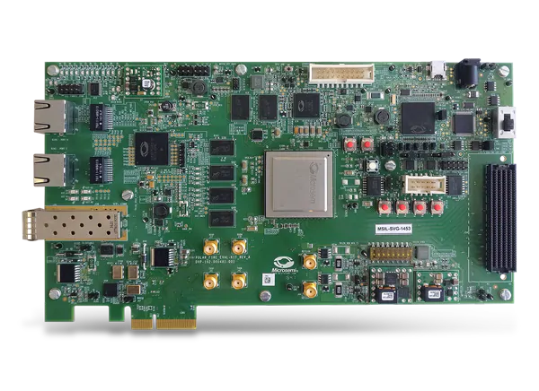

```{r polarfire, fig.align='left', out.width='75%', echo = FALSE}

```

## Mission Statement

Create and test a microcontroller using TMR with various configurations of the RISC-V open source instruction set on Microsemi’s PolarFire radiation tolerant FPGA. This is to test the possibility of using RISC-V architecture in space, specifically the possibility of implementing this system in the CWS in NASA’s newest space suit, the xEMU.

### Goal

The main goal of this semester was to get all communication, GPIO, LCD, and sensor functions created and to get one processor working with all of the requirements. While we weren’t able to complete all of the requirements. We were able to get to a point when with some debugging you should be able to fix all of the issues and create the functions needed to get this project working.

### Completion 

We were able to nearly complete all the requirements for a single core. All that is necessary is to debug and resolve the errors with the LVDS module, add in a LVDS module for receiving data, finish the function to communicate with the LCD screen, and fully test the SPI and I2C modules. Once each of these issues are fix for the core that is alright set up it should be easy to adjust the project to work with multiple types of cores.

## Microcontroller 

### Design

There are two main parts to this project the Libero module design and the Softconsole functions used to test and operate each of the Libero modules.

Last semester’s team left us with most of a working design for Libero. We edited the design to allow for a working Full Duplex UART and LVDS UART that transmits a differential signal but does not receive.

We did the most work with SoftConsole. We added modules to operate the LVDS and Full-Duplex UART, check status of 10 GPIO switches, we started creating functions to output text to the LCD screen and to control the operation through the large switch on the PCB, and debugged the code that wasn’t working correctly. 

<!-- #### Tools -->

<!-- * Libero -  -->
<!-- * SoftConsole -  -->
<!-- * Arduino - Used to test communication  -->

### UART

The biggest problem we encounter with the UART is timing. In the SoftConsole code in order to program the UART to operate at a specific baud rate they use a clock divider equation the becomes inaccurate when the baud rate gets to 1 MHz. The Libero LVDS module is very confusing and isn’t set up to work well with UART. Instead of taking in a single signal and turning one signal into an LVDS signal it reads from an array of signals and transmits them one at a time. To combat the issue we set the have the UART Tx connect to each of the input pins of the LVDS module since this is an array of 8 signals this makes the LVDS UART signal 8 times slower than it would normally be. We were only able to get the LVDS module to output a differential signal that ranges from 0 to 2 volts. All of the Libero documentations says that this is the module needed for LVDS documentation but we weren’t able to figure out how to configure the settings to output an LVDS signal. If try to fix this in the future looking at the low power settings of the LVDS module might be able to resolve this issue. 

### SPI

The SPI module is an IP that was implemented when following the tutorial. It has been changed to include five extra SPI select pins to be used for a couple SPI devices on the PCB, and for some external SPI connections. 

### I2C

The I2C communication capabilities have been added into CPU design using a CoreI2C module. This is connected to the processor via the Advanced Peripheral Bus (APB). This module currently uses a single I2C channel set to Full Master RX/TX mode. Because this module has a separate line for input and output of the serial clock and the serial data, bi-directional buffers are used to combine them. This allows for bi-directional communication using only 2 pins. 

### GPIO 

The GPIO pins initially came from the tutorial also, but have been modified to include 32 GPIO ports, both input and output (so they can be configured in software), and are able to send interrupts signals to the ISR.

The GPIO pins were set to both input and output and the interrupt settings were set in the settings of the Core GPIO IP module. To give them the ability to be both an input and an output, a bi-directional buffer had to be added to each GPIO port (this buffer is also used for the I2C IP). To make things look cleaner in the top Smart Design, all of this was implemented in a sub-module call GPIO_TOP.

## RISC-V Implementations

```{r risc5, fig.align='left', out.width='30%', echo = FALSE}

```

We have the solution for the tutorial we followed implemented as one of our cores. Once we had a solid grasp on the CPU design process, we started from this solution and made the Solution – Copy project. That copy was fully modified to interface with the PCB and should serve as a point of reference if any problems arise. The finished copy was then saved as a separate project for more concise documentation. It was named Solution – MIV_AXI. The three other processor designs are based on this Solution – MIV_AXI. Solution – CoreRISCV replaces the processor in Solution – MIV_AXI with the CoreRISCV processor. MIV_FP and MIV_AHB are alternate processors substituted into Solution – MIV_AXI with one key difference, these two use AHB memory controllers and needed some adaptation to work with the onboard memory (they are close to completion but do require more effort yet to finish them off). All four of these last designs (the three MIV and the one CoreRISCV processors) need to be tested and then they can be benchmarked to see which one works the best.

## PCB Assembly

Assembling the PCB was rather straight forward. The only major hiccup was the proximity of the VGA connectors to one another. The sockets would not all be accessible at the same time for connection given their proximity to one another and the dimensions of a standard VGA cable connector. For this reason, it was decided to use VGA connectors with both 90-degree and 180-degree connections, staggering them so no two of the same were side by side.

## Drivers and UI Design

Once a RISC-V core is built and loaded onto the FPGA, we can use SoftConsole, a software package to program softcores, to run our custom drivers and software on our cores. This is how we set up the interface with the PCB and how we planned on benchmarking the processors.

We used the user interface that was set up by last semesters team and added functionality to allow the FPGA to communicate over UART, check the status of GPIO pins, we started on using it to create an interface to work with the LCD screen, and debugged and fixed many of the issues used to communicate with sensors.

## Acronyms

These are a few useful acronyms when working on this project:

* CWS - Caution and Warning System
* EMU - Extravehicular Mobility Unit
* FIFO - First In First Out
* FMC - FPGA Mezzanine Card
* FPGA - Field Programmable Gate Array
* HPC - High Pin Count
* IP - Intellectual Property
* LPC - Low Pin Count
* LVDS - Low Voltage Differential Signaling
* NASA - National Aeronautics and Space Administration
* PLSS - Portable Life Support System
* RISC - Reduced Instruction Set Computer
* TMR - Triple Modular Redundancy
* xEMU - Exploratory EMU


<br /> <br />

© Copyright BYUI ECEN 499, Spring 2020

###### *--- [Licensed](https://github.com/ECEN499-NASA/ECEN499-NASA.github.io/blob/master/LICENSE) under [MIT License](./site_libs/LICENSE.txt)*

######  *--- Website is made with [Rmd files](https://rmarkdown.rstudio.com/index.html) and [Rstudio](https://rstudio.com/)*

######  *--- Hosted on [github](https://github.com/ECEN499-NASA)*